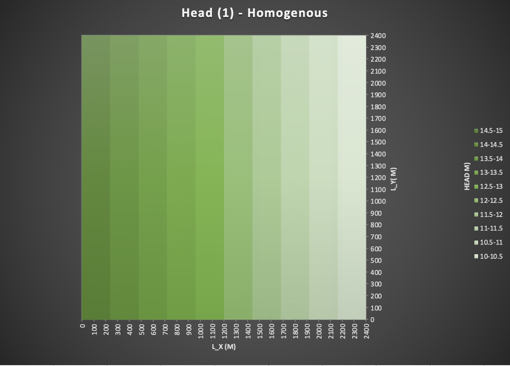
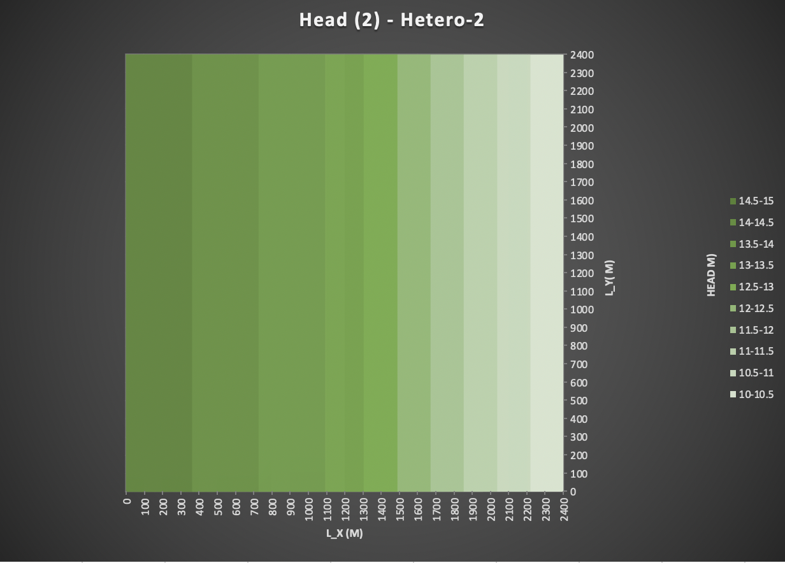
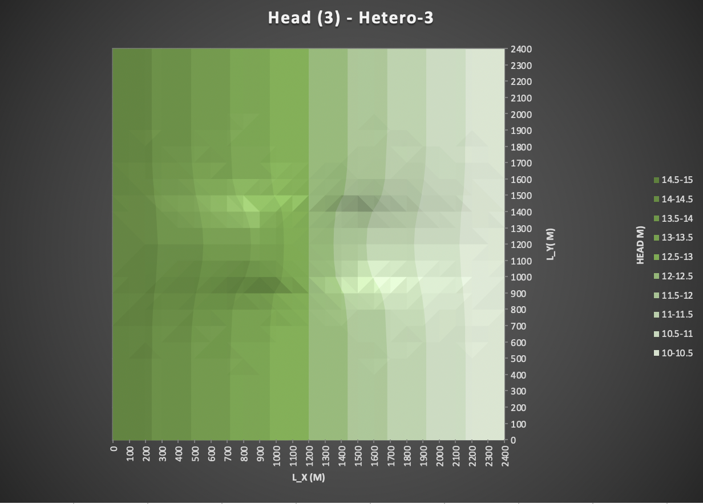

### Resources
* Modflow Help Doc - https://water.usgs.gov/ogw/modflow/MODFLOW-2005-Guide/
* Modflow 6 (next time) - https://www.usgs.gov/software/modflow-6-usgs-modular-hydrologic-model
* http://www.groundwatermodels.com/
* http://www.2018hwr528.weebly.com/domain-and-properties.html
* MODFLOW is really only for water transport

### Presentation:
* Ty Present -> Introduce problem / Facilitate and extend / Come back together
* Use not just the challenge, but also the discussion questions (in order to get
    more in-depth) -> What did you learn.
* A breakout wherein we see how water flows through a hi k / lo k
  * draw flow lines and equipotential lines
  * note symmetry?
  * why does it flow back?

* Other thoughts:
  * Leave space for conceptual discussion BUT ALSO
  * Workflow discussion - like on a keystroke basis what worked and what didn't work
  * And also provide space for some debugging (because for some of us this assignment may have been a non-starter)

* What is meant by model dimensionality (1D and 2D)
* Add drawing of conceptual model 

### Debugging and Questions
* Can't get Modflow to work on Mac

### The Correct Figures

*Figure 1: Steady state head distribution produced by a MODFLOW model of a homogeneous domain.*

*Figure 2: Steady state head distribution produced by a MODFLOW model of a zoned, heterogeneous domain. Left half has K = 1 m/d, right half has K = 0.5 m/d*
**Note: K = 1 for first 12 columns, K = 0.5 for second 13 columns**

*Figure 3: Steady state head distribution produced by a MODFLOW model of a homogeneous domain with a low K inclusion. The inclusion is in columns 11-15 and rows 11-15, inclusive. The background has a K of 1 m/d and the inclusion 0.5 m/d.*

### The Challenge
1. Show, based on the flux with horizontal distance from a constant head boundary, that the model is steady state. Repeat this for a homogeneous and for a heterogeneous column for which zones of different K are placed in series with the direction of flow. Note that the best way to do this is to take the values from the .list file into Excel, combine them with the K values from the .bcf file, and calculate the flux at each point. Keep in mind that heads are calculated at the center of a cell (a node) and the K values are defined over each cell.
  * Show steady state by comparing flux at each point (ie constant flux with depth)
  * Work on q calculation

2. Show the steady state head contour in plan view for the heterogeneous (zones in series) condition. Use this plot to defend a contention that flow is 1D. Then, drawing on your Excel assignment, use the results to explain WHY the equivalent hydraulic conductivity, Keq, is closer to the lower of the two K values.
  * 1D meaning no variation except in one direction?
  * Use the result to explain why the equivalent K is closer to the lower values (again using) the energy argument. May be worth reading more about...
  * The system is more sensitive where the energy is lost.
  * Energy see Jill's Homework

3. Build a model based on a homogeneous domain with a square region of lower K in the middle of the domain. What can you learn based on your explanation of what controls the effective K for a 1D flow system now that you are applying it to a 2D system? What do you think the Keq of this entire system would be compared to the high and low K values? Explain why it is much more difficult to develop a direct solution for this 2D system than it was for a 1D system (including the zones placed in series).
  * No longer 1D because

### MODFLOW
* MAKE SURE THE mf2005.exe is located in the same directory as the input files

* Navigate to directory with starter code
* run mf2005
* write the name of the file when it prompts you
* Or, the more efficient way to do it is to type in mf2005 <name_of_file>
* .nam (name file - it's just a bunch of names)
  * list (tells you outputs)
  * dis (dicretization)
  * bas6 (active, inactive)
  * LPF (structure of model)
  * OC (output control file - where to put the output)
  * PCG (conjugate gradient solve - choosing your solver)
  * Wel (Wells)
  * cbc (head in every cell, recorded in binary to save space)

* Look up syntax on the modflow website!
  * BAS
    * -1 (constant head)
    * 1 (active cell)
    * ? 0 (inactive cell) ?
    * IBOUNd - Boundary condition
    * STRT starting head value
  * DIS
    * NLAY
    * NROW
    * NCOL
    * NPER
    * ITMUNI - time units
    * LENUNI - length units
      * Our model is a one layer model with 25x25 domain
    * DELR - width of the columns
    * DELC - width of the rows
    * PERLEN - length of stress period
    * NSTP - number of time steps in stress period
    * TSMULT - multiplier that says that we are more interested in the (rapid) initial response and then increase the delta t over time
    * ss/tr for steadystate or transient
  * OC (output control)
    * where and how to save...
  * LIS File is very important
    * Percent Discrepancy - a way to troubleshoot
  * Use the
