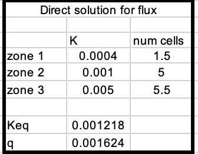
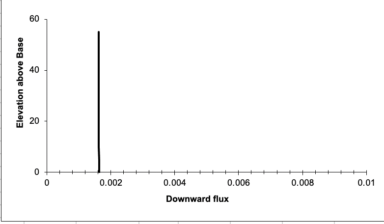
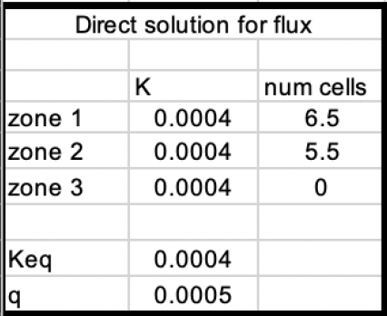
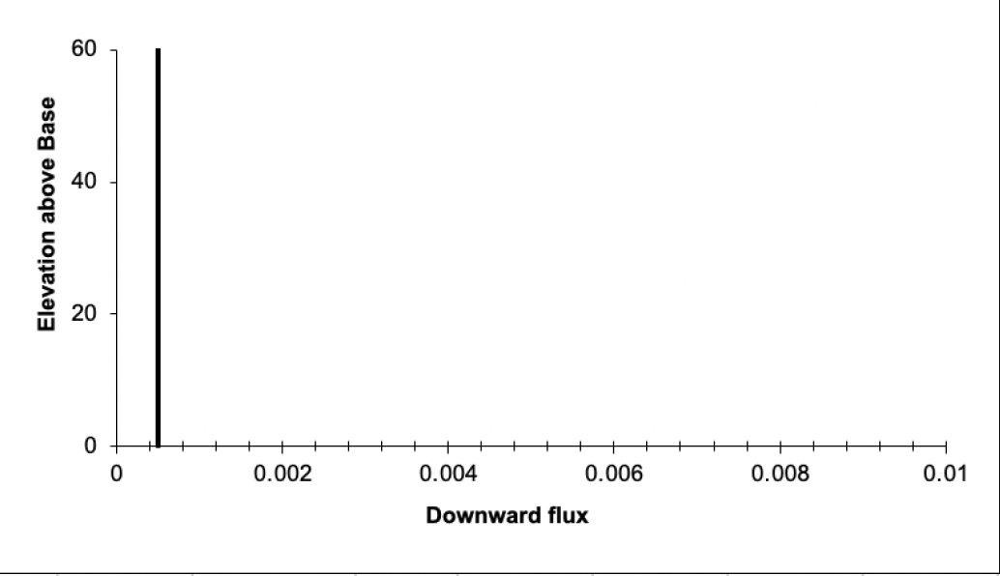
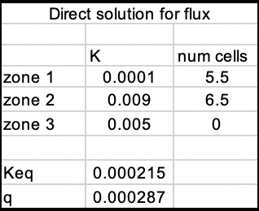
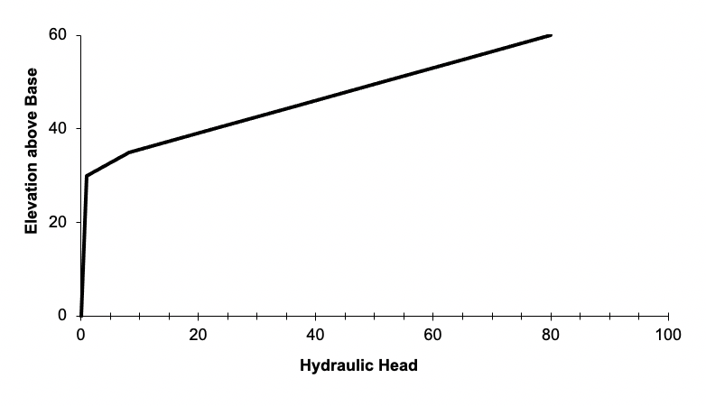
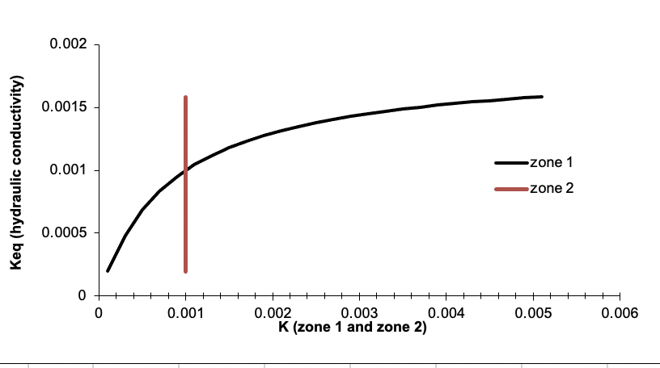

* Quinn Hull
* HW 1
* 01182021

# The Challenge
## 1. Show, based on the flux with depth, that the model is steady state. Repeat this for a homogeneous and for a heterogeneous column.
  * By steady state, we mean that the discharge is unchanging within the model domain over time. By extension, the flux (q) at every point `z` in our 1-D model domain must also be the same. We can see that the model solves for only 1 value of q (implying unchanging 'q' through space and time), and additionally the graphical representation of 'q' is unchanging through space). This applies for both the heterogenous and homogenous models.

  ### **a) Steady state (constant q) through heterogenous domain**
  
  

  ### **b) Steady state (constant q) through homogenous domain**
  
  

## 2. Show that the steady state flux agrees with the direct calculation based on the harmonic mean average K. Write the equation defining the direct calculation of the flux.
  * The direct equation for calculating flux is from Darcy's Law. Namely, that the flux `q` is proportional to the hydraulic gradient `dH/dl` where hydraulic conductivity `K` is the proportionality constant. (We don't need to worry about cross-sectional area because our domain is 1D). In the model `q` is calculated in cell `D12`, the contents of which (`=C11*(I8-I20)/(F8-F20)`), which can be translated to `Keq*(H1-H2)/(Z1-Z2)`.
  * We can check the accuracy of the model by comparing it to the calculation approach. For example, in section 1a (heterogenous model) `q` is **0.001624**. The model results shown in the graph indicate `q` is just barely above **0.0016**. And indeed, when we look at the table of values used to make this plot (`J9:J20`), we see that `q` is exactly **0.001624**.

## 3. Show the steady state head profile for a column with approximately equal-thickness layers that have different K values.

  ### **a) Parameters**
  

  ### **b) Steady-State Head Profile**
  

## 4. Use the head profile to explain WHY the equivalent hydraulic conductivity, Keq, is closer to the lower of the two K values.

  ### a) Monday Submission

  * The Keq of this two-layer model is equal to `0.000215` (or approximately `0.0002`). The two zones have K that are an order of magnitude different, K1 = `0.0001` and K2 = `0.009`. So yeah, Keq is way closer to low-K1 than to hi-K2.
  * To answer 'Why' it might be best to understand how Keq is calculated (i.e. the harmonic mean equation in cell `C11`):
    * `=SUM(D7:D9)/(D7/C7+D8/C8+D9/C9)`, or in plain text
    * `=(num_cells1 + num_cells2) / (num_cells1/K1 + num_cells2/K2)`
    * Given that `num_cells1` ~ `num_cells2` (because the two zones are about the same size), the parameters of interest are `K1` and `K2`, which are located in the denominator of this statement, are what matters in this calculation.
    * Basically, what we'll find that if K1 or K2 are especially small, they will have an outsized effect on Keq relative to a large K1 or K2.
    * This means that the overall `Keq` is really sensitive to low-K layers.
  * Another way to think of it is graphically. If we vary `K1` from `0.0001` to `0.005` while keeping `K2` constant at `0.001`, we can see that **`Keq` is more responsive** (the absolute magnitude of the rate of change is large) **to changes @ small values of `K1`**. It is not  very responsive (the absolute magnitude of the rate of change is small) to changes changes @ large values of `K1`.
  
  * There is a more intuitive groundwater-y reason for this, I'm sure. But the lesson I'm taking is - beware of clay layers!

  ### b) Tuesday Submission

  * Based off our discussion in class, I think the key part to note is that groundwater flows from high energy to low energy, where `H` is an expression of energy, and the hydraulic gradient `dH/dz` is the rate of energy change over elevation.
  * Hydraulic conductivity controls the energy loss in the system. Graphically (e.g. looking at figure 3b), we can see that the amount of energy loss in the system `dH` is much larger in the low-K zone (`dH ~ 78`) than in the hi-K zone. Intuitively, we can see that energy loss is therefore much more sensitive to low-K than hi-K
  * Why is this so? One way to think of it is that the relation between `dH` and `K` is quadratic, i.e. energy loss is proportional to the square of hydraulic conductivity (or did I get that backwards)? Thus we'll see relatively larger `dH` at low values of `K` than at high values.
  * One analogy we thought about in our group was the role of a resistor in a circuit. Although the resistor may be small in size relative to the circuit, it plays an outside role in adding resistance to the flow of electrical current through the otherwise conductive circuit. In this example a highly resistant `R` resistor is analogous to low `K` layer. 
