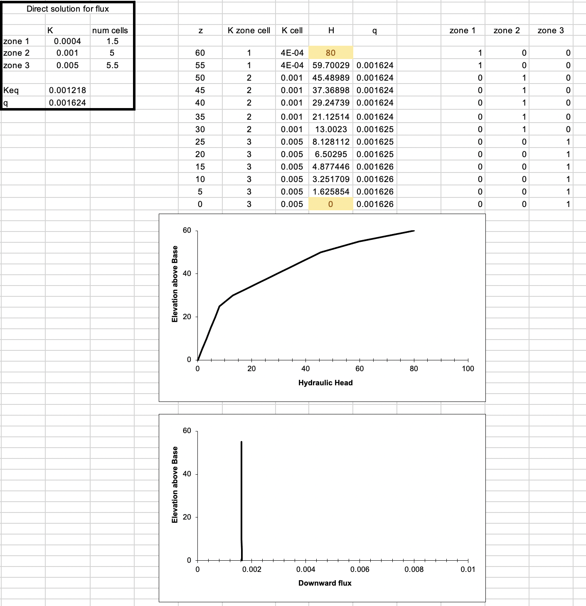

## Questions
1. Just to check, are the inputs into the graphical solution  located on the sheet 'inputs', whereas the inputs for solving (numerically) for K and q is located on the sheet 'model and key plot' cells `C7:C9`? So, the charts will not be affected by the values edited in that (`C7:C9`) range.

2. I don't really understand the iterative solutions thing in excel. I can see that when we change the `inputs`, the solutions for H (column `I`) are change, but then clicking anywhere in the sheet they will change some more. Can you go over that in class?

3. I was having a bit of trouble getting the third layer to render, and I think (maybe) I found an error in the `K zone cell` column. I think maybe the bottom 6 or so rows should also reference `inputs`?
###

## Figure 1 (Homogenous)
* Note I took the route of modifying from your spread sheet!
### Parameters

### Figure

## Figure 2 (Heterogeneous)
### Parameters
* Note I took the route of modifying from your spread sheet!

### Figure

