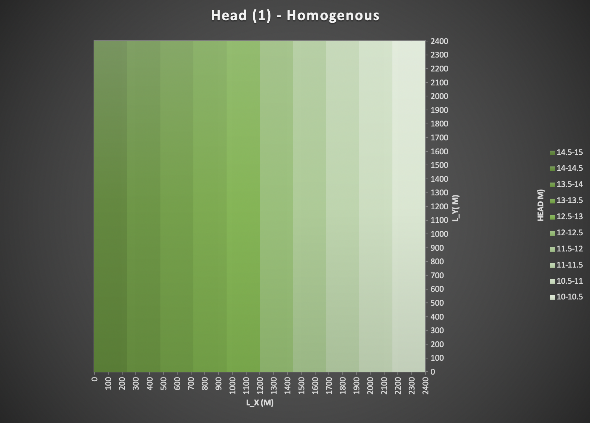
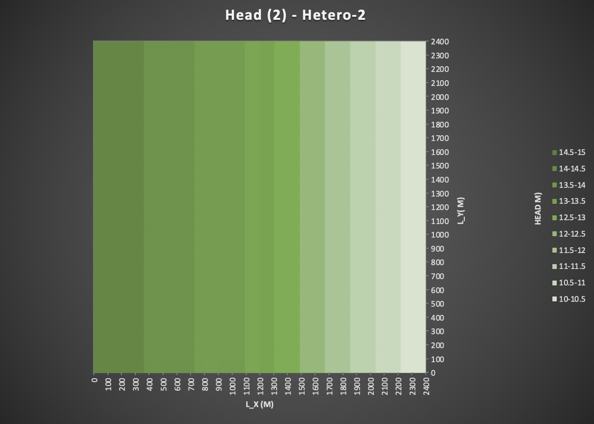

### Quinn Hull
### HW 2
### 01/25/2021

## The Figures
*Figure 1: Steady state head distribution produced by a MODFLOW model of a homogeneous domain.*

*Figure 2: Steady state head distribution produced by a MODFLOW model of a zoned, heterogeneous domain. Left half has K = 1 m/d, right half has K = 0.5 m/d*
**Note: K = 1 for first 12 columns, K = 0.5 for second 13 columns**

*Figure 3: Steady state head distribution produced by a MODFLOW model of a homogeneous domain with a low K inclusion. The inclusion is in columns 11-15 and rows 11-15, inclusive. The background has a K of 1 m/d and the inclusion 0.5 m/d.*

## The Challenge
1. Show, based on the flux with horizontal distance from a constant head boundary, that the model is steady state. Repeat this for a homogeneous and for a heterogeneous column for which zones of different K are placed in series with the direction of flow. Note that the best way to do this is to take the values from the .list file into Excel, combine them with the K values from the .bcf file, and calculate the flux at each point. Keep in mind that heads are calculated at the center of a cell (a node) and the K values are defined over each cell.

> We know that a model is in steady state when the amount of water stored within the model is constant through time. A way of representing that spatially in a model with 1-D, uniform-type flow (i.e. examples 1 and 2) is to check if q along a flow path is constant. q can be calculated from the head (`.list`) and k (`.bcf`) files, where `q = Keq * dH/dL`.
  * It is helpful to establish that within each cell, `dL` is equal to `100` meters as established by the discretization of the model.
  * It's also important to note that `Keq` is of the form of the harmonic mean of `K1` and `K2` in adjacent cells. E.G. `Keq = 2/(1/K1 + 1/K2))`.
  * `dH` is just the difference `H1 - H2`

> Something definitely was wrong with my equation here, because q is not quite linear (close, but not quite)

*Fig 1: q along streamline in homogenous test case*

*Fig 2: q along streamline in heterogenous test case*

2. Show the steady state head contour in plan view for the heterogeneous (zones in series) condition. Use this plot to defend a contention that flow is 1D. Then, drawing on your Excel assignment, use the results to explain WHY the equivalent hydraulic conductivity, Keq, is closer to the lower of the two K values.

> The steady state head contour in plan view can be seen below. We know that flow is 1-D even though the model is 2 dimensional because flow lines don't have a `y` (`j`) component. i.e., the direction of these flow paths can be reduced to only 1 dimension, the `x` (`i`) dimension.

> From class discussion, we have made it clear that systems are most sensitive to where energy loss is highest. In groundwater flow, energy loss is expressed by `dH` and energy is attenuated by porous media at rates negatively correlated to `K`.   
  * Here we know that `Keq` is closest to `K2` (the low-K zone on the left 13 columns of the model) because `dH` is much greater than over 'K1' (the hi-K zone on the right side of the model), where `K1 = 2*K2`.
  * Specifically, `dH2 ~ 4*dH1`, suggesting that there is not a linear relationship between K and dH. In fact, we know that the relationship is quadratic.
  * Intuitively, this makes sense. Groundwater flow that is obligated to move through a low-permeability layer will use up way more of its energy flowing through the low-K layer than it would if not.

3. Build a model based on a homogeneous domain with a square region of lower K in the middle of the domain. What can you learn based on your explanation of what controls the effective K for a 1D flow system now that you are applying it to a 2D system? What do you think the Keq of this entire system would be compared to the high and low K values? Explain why it is much more difficult to develop a direct solution for this 2D system than it was for a 1D system (including the zones placed in series).

> Flow in this example is no longer 1-D, in that is traveling in both the x and y directions. An intuitive way of thinking about this is that the flow is attempting to 'avoid' as best possible the low-K obstruction in the middle, a lot like people walking around a cow on a busy sidewalk

>   
  * The 2D flow system matches our intuition about energy and K. The gradient is steeper in the lo-K inclusion, ie greater energy loss occurs there relative to the Hi-K media around it.
  * One critical difference between the 1-D and 2-D problem is that flow is traveling in both the x and y directions now. Given this, we can't be sure what exactly the Keq value is, at least not using a simple analytical equation (like in a 1-D flow problem).
  * Keq is a function of the interplay of flow paths and the K experienced along flow paths. In 2D flow, the flow paths themselves depend on the K distribution (the structure of the different zones). **Ironically, we can't solve for Keq without first solving for flow direction using a numerical (not analytical) model.**
