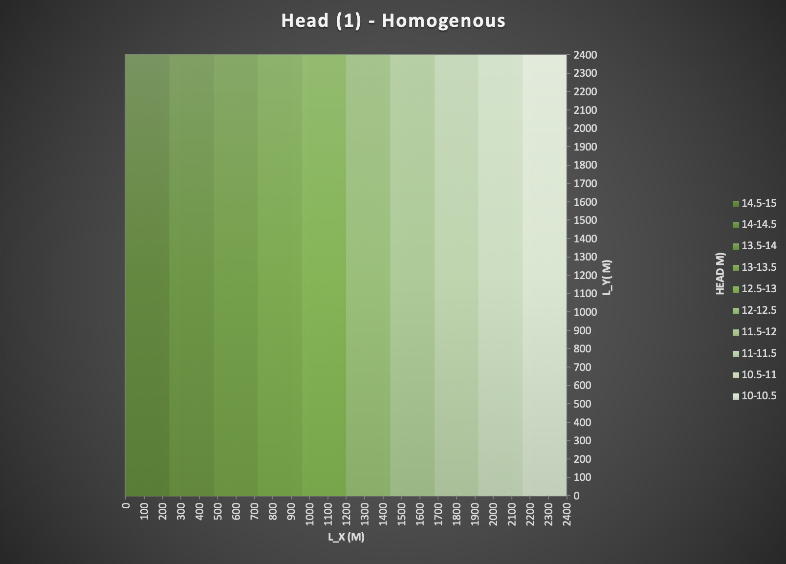
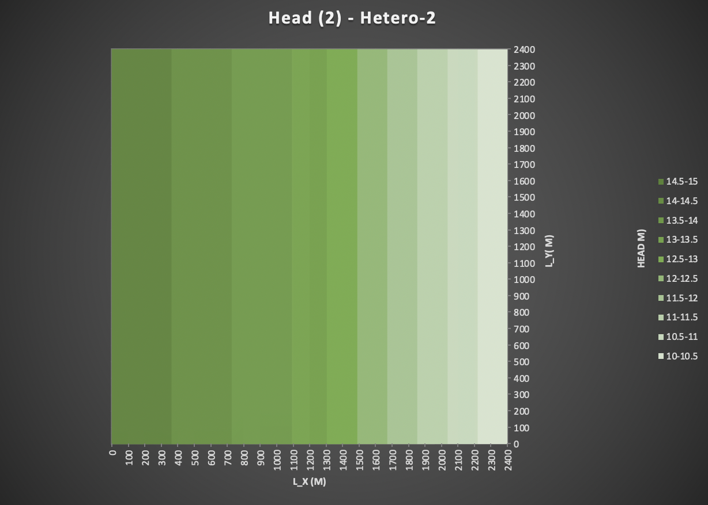
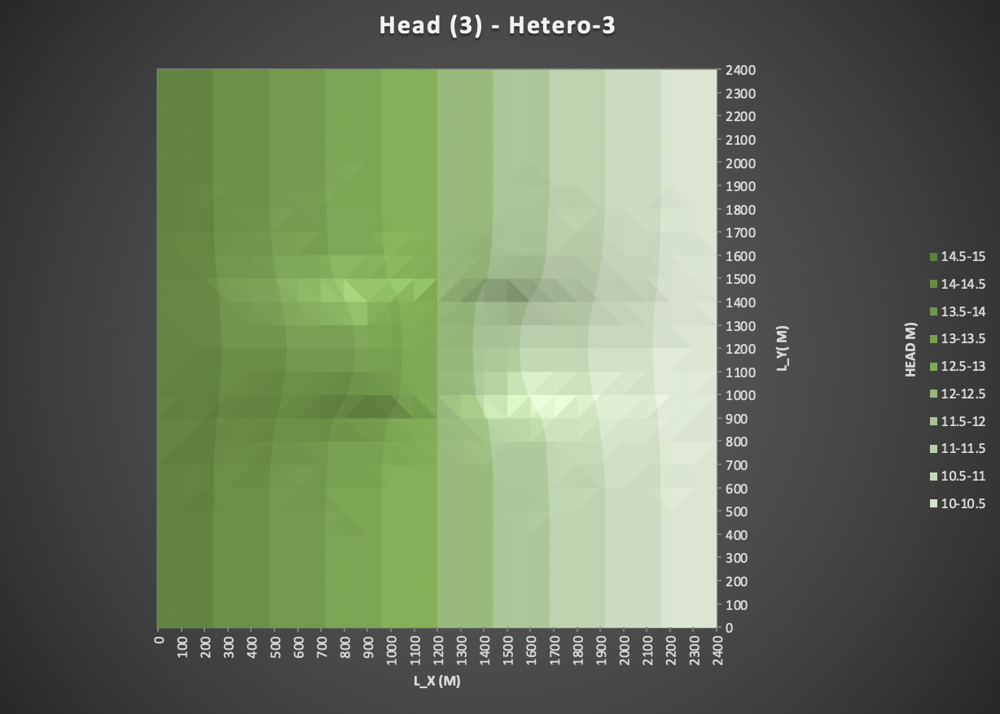

*Figure 1: Steady state head distribution produced by a MODFLOW model of a homogeneous domain.*

*Figure 2: Steady state head distribution produced by a MODFLOW model of a zoned, heterogeneous domain. Left half has K = 1 m/d, right half has K = 0.5 m/d*
**Note: K = 1 for first 12 columns, K = 0.5 for second 13 columns**

*Figure 3: Steady state head distribution produced by a MODFLOW model of a homogeneous domain with a low K inclusion. The inclusion is in columns 11-15 and rows 11-15, inclusive. The background has a K of 1 m/d and the inclusion 0.5 m/d.*

